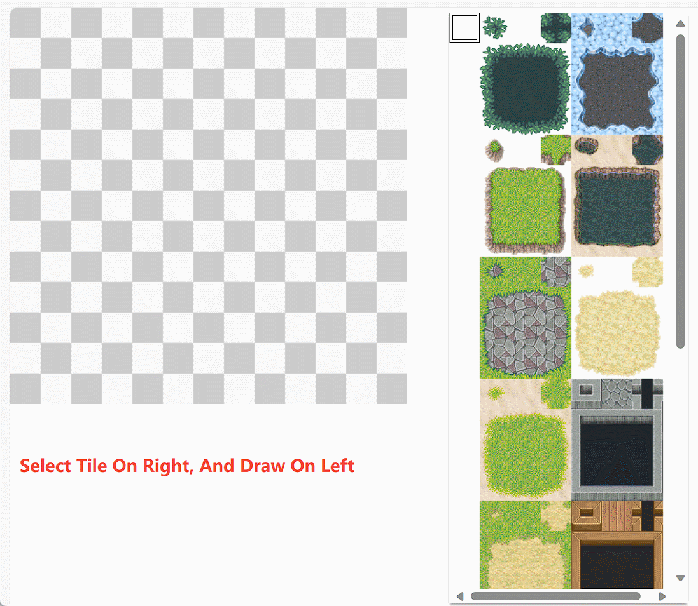
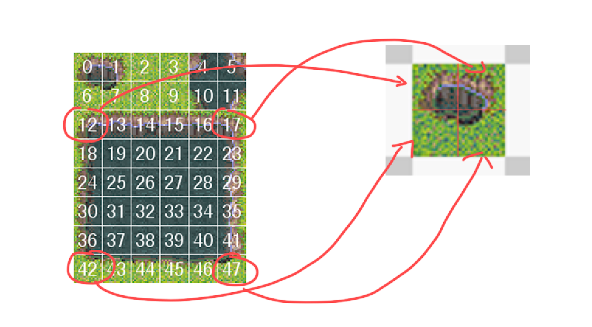
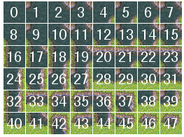
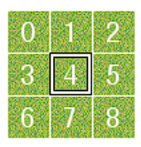
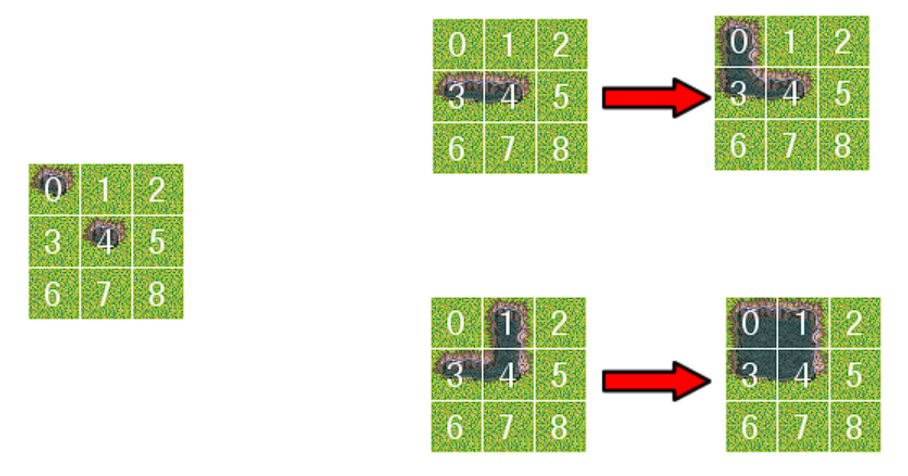

# 2D AutoTile

## How to Use



Open index.html in browser to show the white board and tileset selector.

You can choose different tileset on right side, and select the top-right empty square means eraser.

## Assets Prepare

### Basic Settings

Each tile on white board have size of `32px x 32px`.

The tiles on edges will treats the area outside the whiteboard as if there were other tiles.

### TileSet

TileSet image have size of `96px x 128px`, each tile have size of `16px x 16px`.

So the tileset layout is `6(W) x 8(H)`

### Note

You can of course replace the existing tileset with your own.

Just make sure that the size of each tile is the same length and width. 

And the side length of each area on the whiteboard is twice the length of the tile, just need to change the code about rendering in the code, 

in addition, if you change the layout of `6(W) x 8(H)` of the tileset, you also need to change the corresponding index relationship map in the code.

I'm sure this won't be a problem when you understand the code and theory.

## Theory

Maybe you have noticed that the square side length on the map is twice as long as a single tile, which means that the core idea of AutoTile is splicing.



So the key to the problem turns to what the rules should we follow to select 4 different tiles to splice them into a square on the current map.

It should be noted that there are currently two main modes of simple AutoTile based on 2D. There are 47 or 16 auto tiles.

According to this [GameMaker Manual](https://manual.yoyogames.com/The_Asset_Editors/Tile_Set_Editors/Auto_Tiles.htm):

> The types available to you are 47 tile auto tiles, or 16 tile auto tiles, with (in general) 16 tiles being used for top down or landscapes (since they give nicer transitions) and 47 being used for platformer/side on views or topdown where walls require multiple connections, but that is by no means a hard and fast rule and will depend on how you want your final project to look.

The implementation of this article is based on the 47 tiles because it is more common.

Taking RPG Maker XP as an example, when we open AutoTileSet in it, we can see a picture like this, this is all 47 splicing situations (the last two are the same):



When we need to draw a tile on the map (No. 4), the situation it needs is actually determined based on the eight surrounding tiles.

What affects the drawing situation of tile 4 is whether the surrounding 8 tiles have auto tiles, and the specific situation of each tile does not affect



Mathematically speaking, there should be $2^8 = 256$ situations, which is much larger than 47, but because the simple implementation does not support the interaction of two separate tiles on the diagonal, many situations are removed. As shown on the left side of the figure below, tile 4 will not be affected by tile 1.

Tile 1 will only cause tile 4 to change if there are auto tiles directly to the left and above tile 4, as shown on the right side of the following figure:



When we classify according to how many auto tiles exist in the four directions of tile 4, up, down, left, and right, we can get all the situations below:

(Index represents the number in the 47-tileset after splicing in the above picture)

(T = Top, B = Bottom, L = Left, R = Right)

* 0
    * Only 1 situation, index = 46
* 1
    * 4 situations, B = 42, R = 43, T = 44, L = 45
* 2
    * If they are oppsite
        * T B = 32
        * L R = 33
    * If it is a border, if left and top appear at the same time, the upper left corner is influential at this time. There are two situations where the upper left corner appears or does not appear. Other border edges are the same, so there are $4*2=8$ situations in total.
        * R B RB = 34, R B = 35
        * L B LB = 36, L B = 37
        * L T LT = 38, L T = 39
        * R T RT = 40, R T = 41
* 3
    * Consider that the top, left and right appear at the same time. At this time, the top left corner and the top right corner are influential. There are 4 occurrences of the 2 corners, so there are $4*4=16$ situations in total, and the index corresponds to 16-31.
        * T RT R RB B = 16, T R RB B = 17, T RT R B = 18, T R B = 19
        * L LB B RB R = 20, L LB B R = 21, L B RB R = 22, L B R = 23
        * T LT L LB B = 24, T LT L B = 25, T L LB B = 26, T L B = 27
        * L LT T RT R = 28, L T RT R = 29, L LT T R = 30, L T R = 31
* 4
    * With all four sides, the four corners have $4^2=16$ situations, and the index corresponds to 0-15:
        * None = 0, LT = 1, RT = 2, LT RT = 3
        * RB = 4, LT RB = 5, RT RB = 6, LT RT RB = 7
        * LB = 8, LT LB = 9, LB RT = 10, LB LT RT = 11
        * LB RB = 12, LT LB RB = 13, LB RT RB = 14, LT LB RT RB = 15

The tiles that need to be drawn in each case correspond to the four indexs of the tiles on the asset as follows:

``` js
    [26,27,32,33], //0
    [4,27,32,33],  //1
    [26,5,32,33],  //2
    [4,5,32,33],   //3
    [26,27,32,11], //4
    [4,27,32,11],  //5
    [26,5,32,11],  //6
    [4,5,32,11],   //7
    [26,27,10,33], //8
    [4,27,10,33],  //9
    [26,5,10,33],  //10
    [4,5,10,33],   //11
    [26,27,10,11], //12
    [4,27,10,11],  //13
    [26,5,10,11],  //14
    [4,5,10,11],   //15
    [24,25,30,31], //16
    [24,5,30,31],  //17
    [24,25,30,11], //18
    [24,5,30,11],  //19
    [14,15,20,21], //20
    [14,15,20,11], //21
    [14,15,10,21], //22
    [14,15,10,11], //23
    [28,29,34,35], //24
    [28,29,10,35], //25
    [4,29,34,35],  //26
    [4,29,10,35],  //27
    [26,27,44,45], //28
    [4,39,44,45],  //29
    [38,5,44,45],  //30
    [4,5,44,45],   //31
    [24,29,30,35], //32
    [14,15,44,45], //33
    [12,13,18,19], //34
    [12,13,18,11], //35
    [16,17,22,23], //36
    [16,17,10,23], //37
    [40,41,46,47], //38
    [4,41,46,47],  //39
    [36,37,42,43], //40
    [36,5,42,43],  //41
    [12,17,18,23], //42
    [12,13,42,43], //43
    [36,41,42,47], //44
    [16,17,46,47], //45
    [12,17,42,47], //46
    [12,17,42,47]  //47
```

At this point, the theory of drawing autotile on the map is complete:

When we draw a new tile, we only need to check the status of the tiles around the current tile to get the splicing-index we need, and then use this splicing-index to find the four asset indexs on the asset image. splice tiles to big one and draw it, and then the status of the 8 surrounding tiles on the map also need to be updated.

## Code Details

The only thing that needs to be mentioned in the code is that we use the idea of Bitmask.

Using the following method, if each bit is 0, it means that there is no autotile there, and if it is 1, it means that there is autotile at that position.

```
LEFT: 1,           // 0000 0001
RIGHT: 2,          // 0000 0010
TOP: 4,            // 0000 0100
BOTTOM: 8,         // 0000 1000
LEFT_TOP: 16,      // 0001 0000
RIGHT_TOP: 32,     // 0010 0000
LEFT_BOTTOM: 64,   // 0100 0000
RIGHT_BOTTOM: 128  // 1000 0000
```
Therefore, we can use an 8-bit string to represent the situation around the current tile, and we can also define these eight situations with ints, so that the combination between different situations can be calculated using the `and` and `or` operations (check `CheckAround` method in `AutoTile.js`).