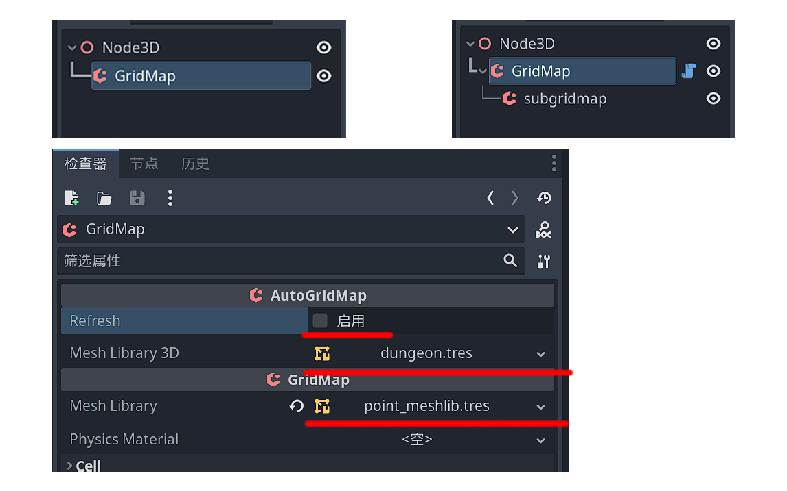
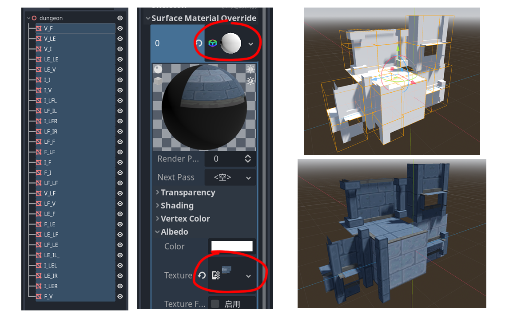
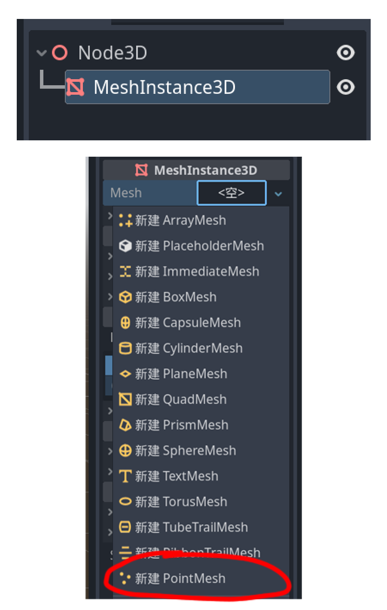
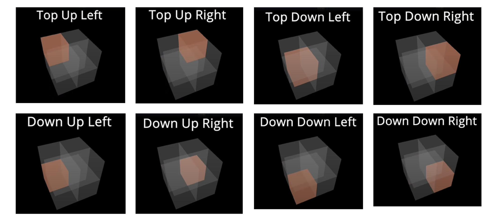
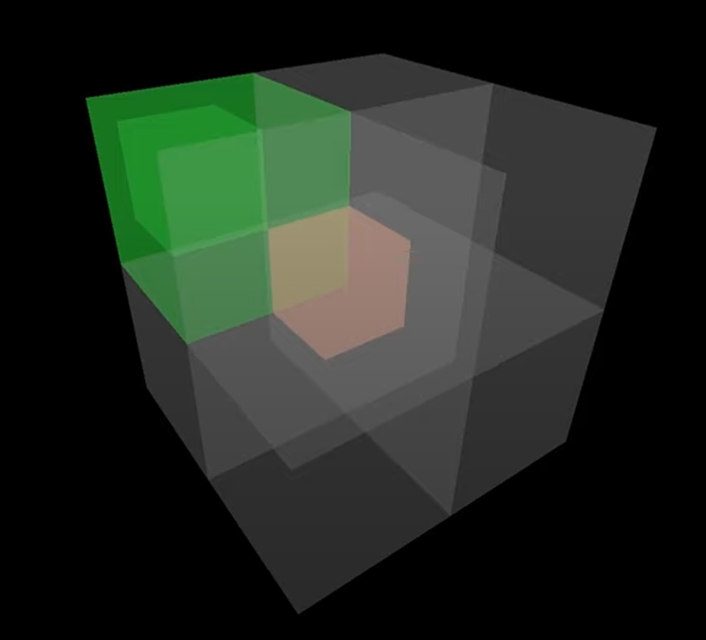

# 3D Auto Tile

## Summary

This repo implement a GridMap-based 3D Auto Tile tech implemented on Godot4 Engine.

It is assumed that the reader has understanding of the operation in Godot4 Engine, the syntax of GD script and Grid Map in Godot4.

## How to Use

### Setting Up

1. Create `GridMap` node in scene.
2. Attach `Auto_GridMap.gd` to that node.
3. Set Assets in inspector, and click `Refresh`.
4. If a new `subgridmap` generated under `GridMap` node means setup successfully.



### Looks Like


## Assets Prepare

### Blender Model And Texture

In this repo, I'm using third-party asset, but I'll tell you how to make yours.

The most important thing is create 27 tiles with all posibility.

Naming the tiles based on the occupied neighbor cells, it's quite similar with 2d AutoTile.

The naming rules is:

For example `V_F` tile, the first letter means top 4 tiles state, and the second letter means bottom 4 tiles state. so the `V_F` means when the top of tile which we want to set is `Void`, and bottom of tile which we want set is `Full`. you can see, it's just a simple platform floor tile.

(About what is top 4 tile and what is bottom tile, please check seciton `BitMask And Meshs`)

When it's `L` means like 3 cell used like a `L` shape, most time, `L` is using with `Empty` or `Full`.

Sometime we have `L` or `R`, it means `Left` or `Right`. because there're some tiles are mirrored and we can't rotate them, it's mirrored version of the tile.

### Meshlib in Godot

Import `glb` asset created in `Blender` we made in last step.

Select all node on left, create `Standard Material` and set `Texture` on it.



This step done, now we can export it to `meshlib` resources, if you want to make more changes on it, you can also export it to `scene`, so you can make other changes on it and re-export to `meshlib` again.

We also can add collision mask on it, just create `tri-static mesh instance` for each node.

### Point Meshlib

For operation in `GridMap`, we also need create a invisible point for dragging in it.

Just create a new scene, and add a `MeshInstance3D` node under root node, then set mesh as `PointMesh`, then export it as `meshlib`.



## Code Details

### BitMask And Meshs

```
const TUL : = 0x01
const TUR : = 0x02
const TDL : = 0x04
const TDR : = 0x08
const DUL : = 0x10
const DUR : = 0x20
const DDL : = 0x40
const DDR : = 0x80
```

`BitMask` use signal like above, and the meaning of each of them is as follows.



Then look at `_setup()` method, me can make matches between pattern and correct meshes we created, but notice, if you want to use this code but use your own asset without my naming rules, you need to change pattern code here.

`mesh_library_3d` is the `meshlib` assets we set in inspector.

```
// Get Index of mesh
var lf_le = mesh_library_3d.find_item_by_name( "LF_LE" ) #  0
...
// Set every posibility of the mesh and rotation
meshes = {
    TUL | TUR | TDL | DUL : { "mesh" : lf_le, "orientation" : 0  },
    TUL | TUR | TDR | DUR : { "mesh" : lf_le, "orientation" : 22 },
    TUR | TDR | TDL | DDR : { "mesh" : lf_le, "orientation" : 10 },
    TUL | TDR | TDL | DDL : { "mesh" : lf_le, "orientation" : 16 },
    ...
}
```

### Setup And Get BitMask

In the code, we need to setup `subgripmap`, worth to notice that part could only be used in editor, so that, we need to use keyword `@tool` on the top.

In `get_cell_mask()` method, we use it to get 26 surrounding tiles to see if they are empty.

In `get_main_cell_item()` method, we will check the 4 surrounding riles first, we do this for all edges and corners, and then we get 6 sides.



And combines those 6 sides situation, we can get the final mask, then use dictionary find mesh and rotation.

### Overwrite set_cell_item

`set_cell_item()` method is use to draw in editor and set tiles in `GridMap`.

```
if Engine.is_editor_hint():
	update_bitmask_area( position.x, position.y, position.z )
```

this code means it will only execute in editor when you draw it, otherwise it will be called so many times if you call it by code and set too many tiles. 

In `update_bitmask_area()` method, it will check 4 surrounding big tiles, if you're not use it in editor, we should call update region.

### Applying Autotile

`update_sub_cell()` method is where we update the cell with correct tiles.

If main cell is empty, simply remove sub cells. If not, we get bitmask and check if it is in dictionary, then set `subgridmap` with corresponding mesh and rotation.

### Update Region

If we use this tool by code to update big region, we should call `update_bitmask_region()` method.

If we use this tool by code to update small region, we can just call `update_bitmask_area()` method, this will only update 1 tile and surrounding tiles. so maybe we're using terrian or something player can break tiles, we don't want to update big area, we should use this one.

For `update_bitmask_region()` method, it accept `start` and `end` optional paramaters, if don't pass them in, it will get everything in `GridMap`, iterate them to get then Max and Min value for `start` and `end`.

it will call `update_cell()`, in this method it will only update the tile self, it will not update neighbours, so it's faster, then update all borders also.

### Tips

The shortcuts for changing layer (`Q` and `E`) are unavailable now, but we can use input on the top of level viewer, so we still can draw a wall.

Hold `Shift` will allow you select a region.

`Ctrl + F` can fill a region.